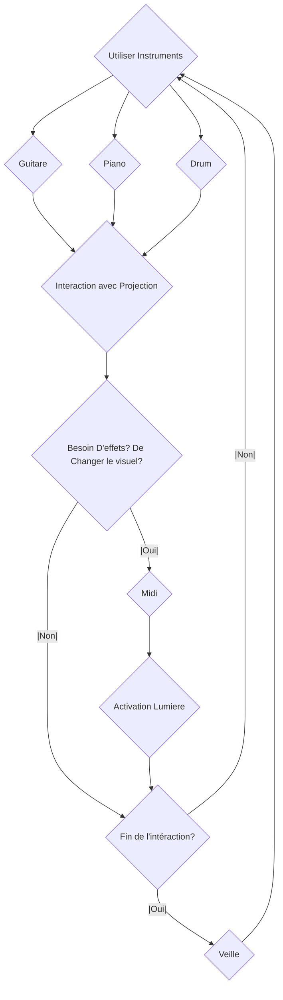
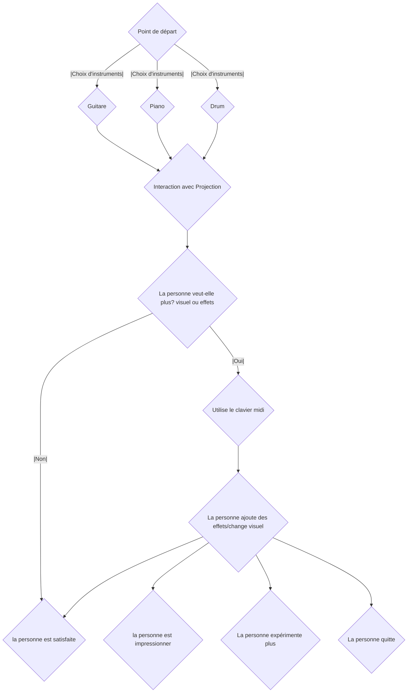

# Interconnecté

## Idée

### Concept
Créer une sorte de concert personnel mais accessible au public. Celle-ci aurait des petites sculptures qui seront projeté par des projecteurs (3d Mapping) ainsi qu'un écran au centre. Ces projecteurs projecteront des visuels, l'écran projectera un visuel différent (peut être changer, différent options) et intéragiront avec l'audio. L'audio provient des instruments différents proposés (Guitare, Piano et Drum). Puis, un controlleur midi sera au centre pour mettre plus d'effets synth et de changer de visuelles, et des indicateurs lumières sur les côtés guideront et démontreront visuellement l'effet mis (s'il y a un effet qui marche, les lumières l'indiqueront).

## Références et inspirations

### Planche d'ambiance visuelles

### Planche d'ambiance sonores 

Pour l'ambiance générale, je cherche quelque chose qui va de normal (instruments normal) vers des effets synth, etc. Le choix d'un son "synth" ou "synthwave" serait car le son est plutot cinématique et me marque beaucoup.

https://youtu.be/iJjRTL1xcKI?t=212

https://youtu.be/iJjRTL1xcKI?t=138

https://youtu.be/-ZuS0p2qRYo?t=55

## Références artistique
Donc l’esthétique va de quelque chose plus réaliste/organique (sans effets) vers quelque chose de plus « synth ». Le visuel va renforcer cela, lorsqu’on va vers le synth, les visuels vont être plus abstrait. Les grosses références pour le projets sont les concerts. Certains de ces concerts on des visuels attrayant ce qui est une grosse qualité que je veux pour ceci.

https://youtu.be/VB7JBN37nlY?t=66

https://youtu.be/l1ZlwbHuhrU?t=58

https://youtu.be/lrJ2x7oOE5w?si=ycnQVbG8hp6aMAc-

## Scénario Interactif

### Interactif

### Narratif

## Technologies

### Support médiatique
Donc, il aurait quelques mp4 pour les bases des visuels, ensuite les instruments seront la source audio, et en midi il interagiront avec les autres logiciels (Touch Designer, reaper, Max, Qlc ou SoundSwitch) pour permettre une interaction visuelle et audiovisuelle.

### Matériel

#### Électronique
- 1 ou 2 projecteurs
- 1 Écran (Assez grosse taille) sinon plusieurs petits écrans ensemble
- Plusieurs lumières
- Sculpture Abstraite (2-3)
- Pédale (Peut être une idée)
- Ordinateurs
- Controlleur Midi
- Fils nécessaire pour connecter les éléments entre eux.
- Speakers

#### Instruments
- Akai MPK Mini Plus 37-key Keyboard
- EART Electric Guitar SSS Single Coil
- Donner Electric Drum Set

### Logiciels
Différents Logiciels seront utilisé pour que les projections, les instruments et les lumières intéragissents entre elles.

- Touch Designer (Pour la projection et l'intéraction sur les visuels)
- MadMapper (Pour mapper les visuels sur les sculptures)
- After Effects (Pour les visuels de bases de l'écran)
- QLC+ ou SoundSwitch (Pour les lumières et l'intéractivité avec celle-ci)
- Reaper ou Max (Pour la détection d’audio des instruments, et les effets sur celle-ci)
- Blender / Maya (Pour les bases de visuels 3D, objets, etc.)

Ceci sont des suggestions, il faudrait faire des tests pour confirmer.
Le réseau de communication serait majoritairement midi car celle-ci est faite pour la détection d’audio d’instruments musicales.

## Réferences: 

https://village-numerique.mutek.org/fr/installations/isochrone-par-manuel-chantre
