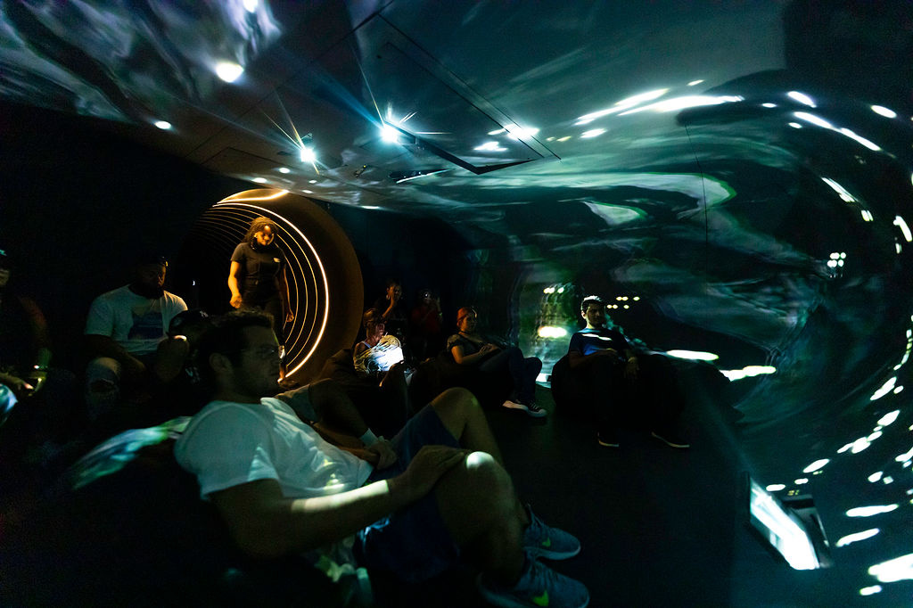
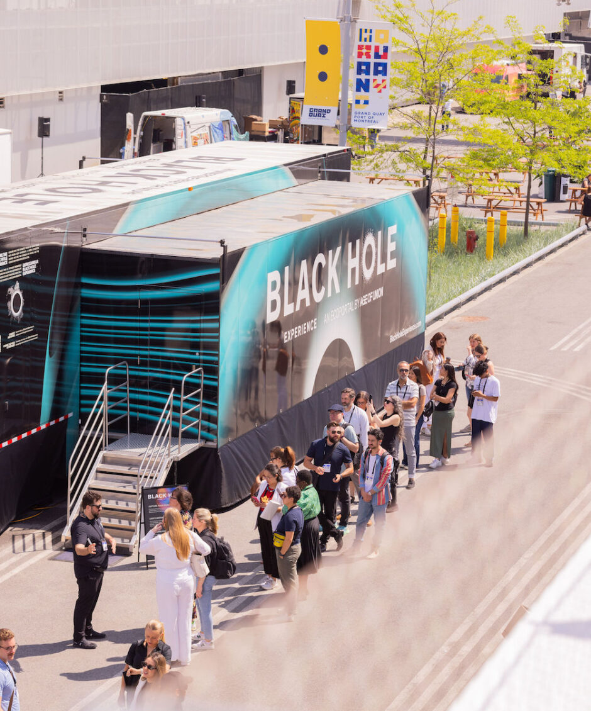
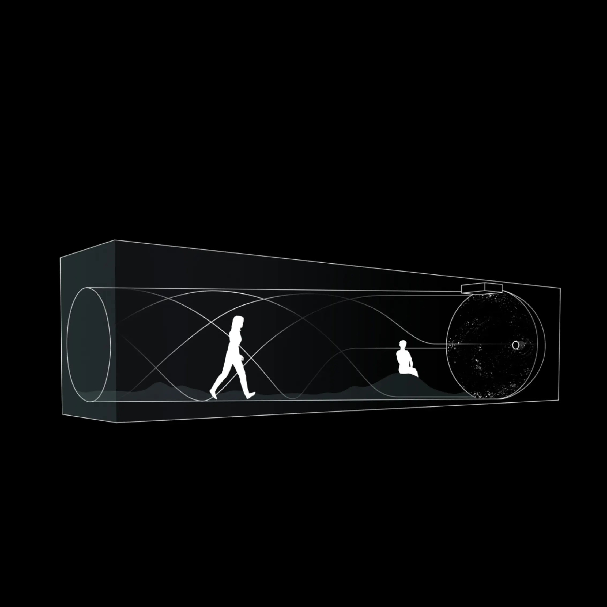
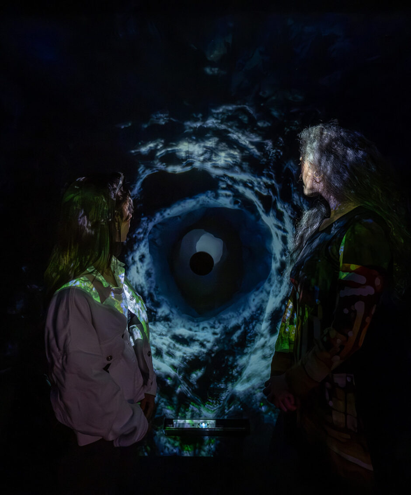
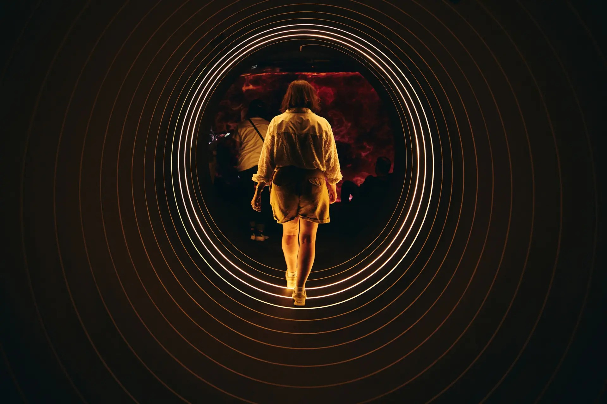
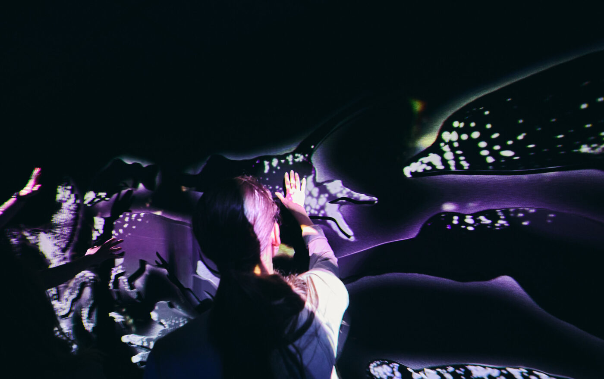

# Black Hole Experience

## Qui ?
### Figures Importantes: 
 - Kelly Nunes (Artise Multi-Disciplinaire)
 - Dax Dasilva (Entrepreneur, producteur du projet)

### Équipe de production:

Conception et Réalisateur:
- Kelly Nunes

Directeur Technique: 
- Mattieu Gagnon Lamarre

Design Interaction: 
- Studio Ottomata

Développeur Touch Designer:
- Owen Kirby

Design 3D: 
- Michael Carosllo, Daily tous les jours

Fabrication: 
- Scene Ethique

Design Audio:
- Phil Rochefort

### Compagnies Impliqué à la Création:
- Age Of Union
- Lightspeed Commerce Inc.

## Quand ?
### Date de Création: 
2020-2024 (Aucune Date Spécifié donné)

### Première
Pour la première fois dévoilé à C2 Montréal (21 Mai au 23 Mai)

## Où ?
### Lieu de présentation initiale:
Le premier endroit où le BHX a été montré est à Montréal lors de la conférence C2. C2 est une conférence annuelle qui se tient depuis 2012.

### Dates Importantes:
- PRIDE TORONTO (Juin 28-30 2024)
- CHICAGO (Juillet 19-21 2024)
- TIMES SQUARE NYC (Aout 2-4 2024)
- BOOTS & HEARTS FESTIVAL (Aout 08-11 2024)
- MUTEK FESTIVAL (Aout 20-25 2024)

## Quoi ?
### Description Générale :
L'expérience ce passe dans un petit espace, cela inclue un petit corridor avec des lumières qui s'ouvre lorsque on passe à travers et à la fin de ce corridor, il y a une petite chambre avec des projecteurs 3D et un trou, où l'expérience commence. Accompagné d'un visuel projeté et d'une trame sonore, l'expérience se catégorise comme médiatique, émotionnel et conceptuel.

Vidéo: https://youtu.be/EXMW9np8gYE

### Objectifs de l'oeuvre :
Le "Black Hole Experience" ou "BHX" est une experience qui interconnecte les utilisateurs avec la nature/ le cosmos. Comme mentionné précédemment, il est plutot médiatique, et laisse l'utilisateur pensé tout en étant accompagné par les sons du cosmos et le visuel lui étant montré. Le site Internet décrit la raison pour avoir utilisé un trou noir comme sujet en expliquant: 
> "Les trous noirs sont l'un des plus grands mystères scientifiques de notre univers, et peuvent être un fort symbole de la relation que l'humanité entretien avec l'inconnu, mais ils peuvent aussi nous faire apprendre sur nous-mêmes, et comment on peut apporté des changements positifs dans le monde."

### Public Cible :
Pour tout le monde, mais majoritairement visé pour les personnes étant capables de penser et de faire de la réflexion (Par exemple: pas pour les bébés). Donc une certaine maturité doit être acquise. 

### Aspects Techniques :
Certaines techniques utilisées dans l’œuvre peuvent inclure un projecteur 3D (pour le visuel), de la lumière, l’utilisation de la spécialisation auditive (sons du cosmos), et d’une technologie permettant de détecter les personnes et de pouvoir illuminer les lumières les plus proches (de la programmation, détection à temps réel).

### Processus de création: 
Il n'y a pas tant d'information. Cependant nous savons un peu les rôles, Kelly Nunes étant l'artiste et le créateur du concept. Ensuite, il y possiblement eu différentes étapes, comme la création du visuel, de la trame sonore, la production du corridor, la programmation des lumières, le 3D mapping, etc. Toutes des différentes étapes essentiel mais non documenter, possiblement à cause d'une raison de confidentialité, etc.

## Comment ?
### Composante Centrale :
La composante Centrale serait en effet la chambre et tout ce qui est inclut , car c’est la ou la vraie expérience ce passe. En effet, le mélange d’une pièce isolée, d’un visuel, d’une trame sonore et d’un trou dans le mur qui caractérise le trou noir est vraiment ce qui rend cette expérience le « BHX ».

### Fonctionnement :
C’est l’endroit et les outils qui mènent à pouvoir penser et s’immerger dans l’univers du « BHX ». Le projecteur 3D projète le visuel, les speakers qui jouent la trame sonores, etc. Et le manquement d’un seul élément pourrait brisé cette expérience, et ne pas délivrer le message voulant être transmis. Chaque élément jouent un rôle important.

### Impact : 
C’est ces composantes qui permet de transmettre le message, et c’est celui-ci qui laisse un impact sur le spectateur. Et cette harmonie de média, le visuel (créateur d’univers), l’audio (l’élément qui immerse) et finalement cette isolation avec le trou noir qui se trouve devant nous, toutes ces composantes différentes et ensemble permettent la transmission du message de réflexion et de positivité.

## Appréciation
J’ai beaucoup apprécié le BHX car je suis naturellement attiré par œuvres abstraites et conceptuelles. Et puis lorsque j’ai entendu le mot « trou noir » dans le nom de l’œuvre, j’ai tout de suite été intéressé. Puis, j’ai encore plus aimé l’œuvre lors de la recherche en apprenant le message et intention derrière celle-ci. De plus, cette œuvre est relativement « simple » mais qui a un message beaucoup plus profond et positif, quelque chose qu’on associe pas nécessairement avec un trou noir et cela me fait l’aimer encore plus. Finalement, les vidéos démontrant l’expérience m’ont vraiment captivé (visuels, audios, lumières, etc).

## Référence 

https://kellynunes.com/Black-Hole-Experience

https://www.blackholeexperience.com/
